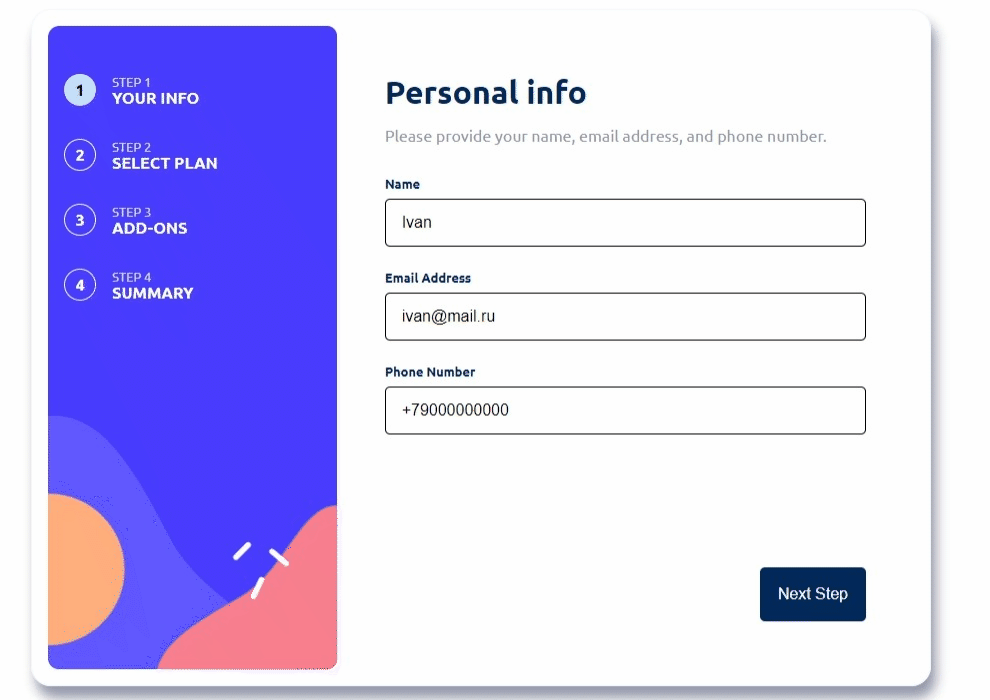

# Multi step form

## Built with

HTML/CSS/SCSS/React/JSON Server

### Description
A multi-step form: 4 steps. You have to fill in your personal information: name, email, and phone, and choose the plan that you like the most and the extra features. After that, the information is stored and sent to a fake web server.

### Link
https://multi-step-form-five-omega.vercel.app/

### Available Scripts

In the project directory, you can run:

### `npm start`

Runs the app in the development mode.\
Open [http://localhost:3000](http://localhost:3000) to view it in your browser.

The page will reload when you make changes.\
You may also see any lint errors in the console.

### `npm run build`

Builds the app for production to the `build` folder.\
It correctly bundles React in production mode and optimizes the build for the best performance.

The build is minified and the filenames include the hashes.\
Your app is ready to be deployed!

See the section about [deployment](https://facebook.github.io/create-react-app/docs/deployment) for more information.

